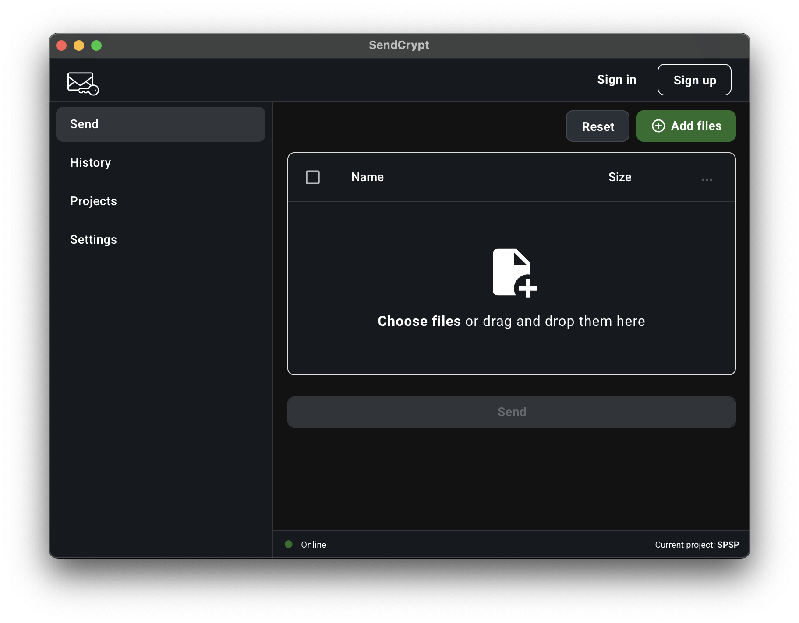

# SendCrypt

Meet SendCrypt, the friendly desktop app created with care by the SIB - Swiss Institute of Bioinformatics! It's your go-to tool for sending sensitive data with confidence. With its easy-to-use interface and top-notch features like PGP encryption and SFTP transfer, SendCrypt makes sure your data stays safe and sound while you focus on what matters most.
## How to install SendCrypt

- Download it [from the website](https://sendcrypt.sib.swiss/download)
- Download it [from the releases page](https://github.com/sib-swiss/sendcrypt/releases/latest)

We publish binaries for MacOS, Windows, and Linux.




👉 [Report a bug](https://github.com/sib-swiss/sendcrypt/issues/new)

## SendCrypt Features

Top features: Easy to use, fast and secure.

- Cross-platform: Windows, MacOS, and Linux
- OpenPGP encryption
- SFTP file transfer
- Generation of PGP key pair
- Import of PGP key pair
- Generation of SSH key pair
- User-friendly interface
- Project configurations stored
- Authentication
- Support of very large files
- No dependency on third-party services

## Documentation

Check out the [documentation](https://clinbiokb.sib.swiss/s/sendcrypt) for user guides, FAQs, troubleshooting tips, and more.

## License

SendCrypt is licensed under the [MIT License](./LICENSE.md).

## Contributing to SendCrypt

We welcome contributions from the community. Please refer to our [contributing guidelines](./CONTRIBUTING.md) for more details.

## Compiling and Running SendCrypt from Source

```bash
# Clone the repository
git clone git@github.com:sib-swiss/sendcrypt.git

# Go to the project directory
cd sendcrypt

# Install dependencies
npm install

# Run the app
npm run start
```

## Release Process

1. Update the version in `package.json`
2. Make sure that your `.env` file is set up correctly depending on your platform
3. Make sure that your `.env` file contains a `GITHUB_TOKEN` with the correct permissions
4. Run `npm run publish`
5. The previous command will create a pre-release on GitHub and upload the binaries to the release
6. Once the binaries are uploaded, you can edit the release and change it to a stable release
7. Done! 🎉

## Contact

For any questions, please contact us at [Dillenn Terumalai](mailto:dillenn.terumalai@sib.swiss)